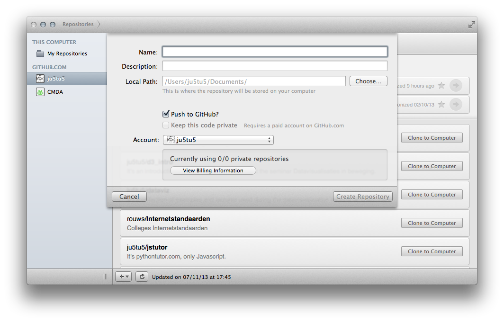

# remarkable?!
It's a markdown presentation tool

!

# git + markdown = remarkable
1. git voor versiebeheer (account en repository aanmaken)
2. markdown voor documenten (markdown README aanmaken)
3. remarkable voor presentaties (een HTML presentatie maken)

!

# git by Linus Torvalds

> Git is a free and open source distributed version control system designed to handle everything from small to very large projects with speed and efficiency. - git-scm.com

!

# not only on the command line
git werkt volledig op de command-line werkt maar er zijn ook een heleboel prettige en minder prettige [GUI's](http://mashable.com/2013/06/24/markdown-tools/ "Mashable - 78 Tools for Writing and Previewing Markdown")

!

# another account? (github.com)

- Download de client voor jouw OS
- Maak een account aan op github.com
- Geef als je klaar bent jouw git-username door aan Joost of Justus

!

# hello world i'm a repository

- Maak een nieuwe repository aan door op het plusje te klikken (onderin op MacOS, bovenin op Windows)

!

# hello world i'm a repository

- Geef een zinnige naam (bv. presentations of workshops) en een korte beschrijving (bv. It's a collection of presentations used for X)
- Kies een lokale map waar je dit project in wilt aanmaken
- Laat het vakje 'Push to GitHub?' aangevinkt
- Gebruik je eigen account (om vervuiling van CMDA/ te voorkomen)
- Klik vervolgens op 'Create Repository'

!

# hello world i'm a repository

- Controleer op github.com of je repository is aangemaakt
- Open de zojuist aangemaakte repository door er op te klikken

!

# hello world i'm a repository

!

# so much for git :)

!

# how about markdown?

!

# markdown
> Markdown is a text-to-HTML conversion tool for web writers. Markdown allows you to write using an easy-to-read, easy-to-write plain text format, then convert it to structurally valid XHTML (or HTML). - daringfireball.net
